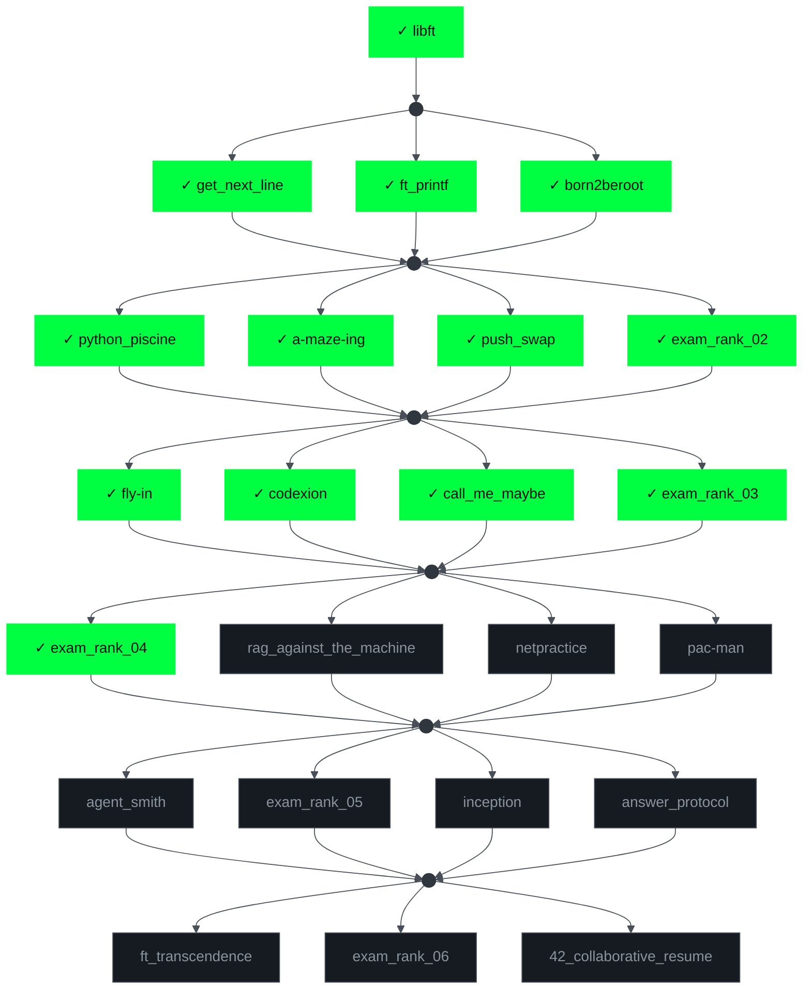

<div align="center">


</div>

```console
Last login: Thu Jan  3 13:37:00 2026 from 127.0.0.1
```

```console
$ neofetch
```

```text
 ██╗██████╗ ██████╗ ███████╗    hmza@1337
 ██║╚════██╗╚════██╗╚════██║    ────────────────────────────────────────
 ██║ █████╔╝ █████╔╝    ██╔╝    User:      hamza — goes by "h" · 0hmza
 ██║ ╚═══██╗ ╚═══██╗   ██╔╝     School:    1337 · 42 Network · Morocco
 ██║██████╔╝██████╔╝   ██║      Track:     new Common Core ...... [13 validated]
 ╚═╝╚═════╝ ╚═════╝    ╚═╝      Degrees:   Licence Informatique · DEUST (USMS)
                                Uptime:    learning since day 0, zero reboots
                                Motto:     rebuild it from scratch, every time
```

```console
$ ls -l ~/projects/
```
| binary | exit | what it taught me |
|:-------|:----:|:------------------|
| ${\color{#00FF41}\texttt{libft}}$ | 0 ✓ | rebuilding libc — memory, strings, lists |
| $`{\color{#00FF41}\mathtt{ft\_printf}}`$ | 0 ✓ | variadic functions & format parsing |
| $`{\color{#00FF41}\mathtt{get\_next\_line}}`$ | 0 ✓ | file I/O, buffers & static memory |
| ${\color{#00FF41}\texttt{born2beroot}}$ | 0 ✓ | VM setup, partitioning, sysadmin & hardening |
| $`{\color{#00FF41}\mathtt{push\_swap}}`$ | 0 ✓ | sorting under constraints, complexity |
| ${\color{#00FF41}\texttt{a-maze-ing}}$ | 0 ✓ | maze generation, my own algorithms |
| $`{\color{#00FF41}\mathtt{python\_piscine}}`$ | 0 ✓ | Python fundamentals & OOP |
| ${\color{#00FF41}\texttt{fly-in}}$ | 0 ✓ | 2D graphics & the game loop |
| ${\color{#00FF41}\texttt{codexion}}$ | 0 ✓ | working inside unfamiliar code |
| $`{\color{#00FF41}\mathtt{call\_me\_maybe}}`$ | 0 ✓ | UNIX signals & process communication |
| $`{\color{#00FF41}\mathtt{exam\_rank\_02..04}}`$ | ✓ ✓ ✓ | proctored — no internet, just me and moulinette


```console
$ tree ~/common-core/    # green = validated · grey = not yet · dots = floor gates
```



```console
$ which -a skills
```

<div align="center">


<br>


</div>

```console
$ git log --graph --all
```

<div align="center">


</div>

```console
$ ./contact.sh
```

<div align="center">

<a href="https://github.com/0hmza"></a>
&nbsp;
<a href="[MY_LINKEDIN_URL]"></a>
&nbsp;


</div>

<br>

<details>
<summary><code>$ sudo cat /root/.secrets</code></summary>
<br>

```text
[sudo] password for hjalzim: ********
sudo: permission denied — nice try though.
$ echo $?
1
```

</details>

```console
$ exit
logout
Connection to 1337.ma closed. [process exited with code 0]
```

<div align="center">


</div>
